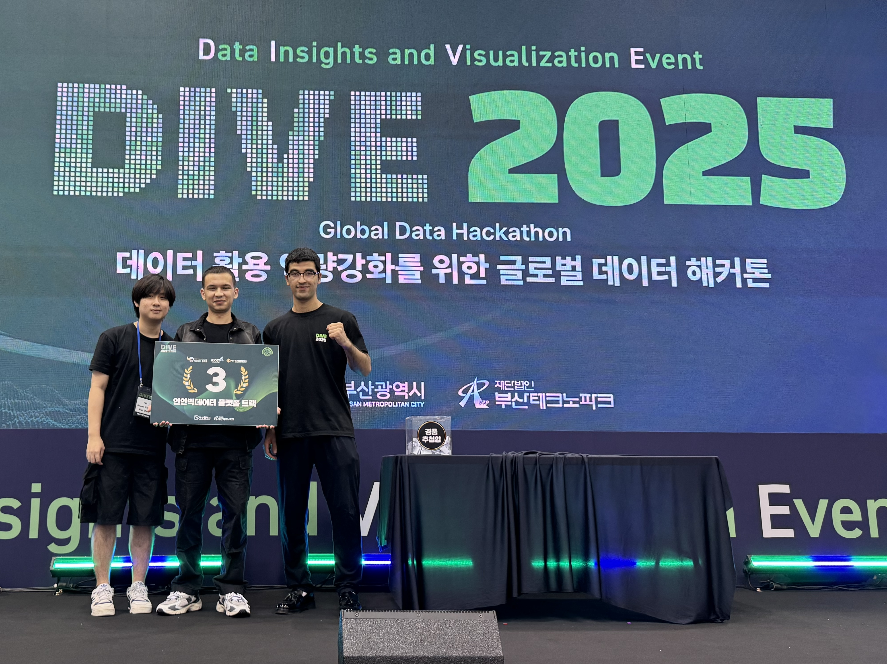

# 🌊 BREEZE - Smart Marine Safety & Fishing Companion

A comprehensive smart watch application designed for marine safety monitoring and intelligent fishing assistance, built for DIVE2025 hackathon.

## 📱 Overview

Breeze is an advanced smart watch application that combines marine safety features with AI-powered fishing analysis to enhance the experience of marine enthusiasts, fishermen, and divers. The app provides real-time environmental monitoring, emergency services, and intelligent fishing recommendations.

**🏆 Achievement: 3rd Place Winner in DIVE2025 Track Partner's Challenge**

## 👥 Team

**BREEZE** was developed by:
- **[Zhen](https://github.com/yamazhen)** - Swift Developer
- **[Nodirbek](https://github.com/nodiry)** - Team Leader &  Swift Developer
- **[Jamshidbek](https://github.com/jamie10x)** - Kotlin Developer

The Kotlin project is located in Jamshidbek's repository. If you're interested in accessing it, please reach out to him directly since it's a private repository.

## ✨ Key Features

### 🚨 Safety & Emergency Features
- **Emergency Gesture Detection**: Tap-based emergency activation system
- **Automatic Emergency Response**: Direct calling to emergency services (112)
- **Health Monitoring Integration**: Real-time health data tracking
- **Alert System**: Weather and typhoon warnings with automatic monitoring

### 🎣 Smart Fishing Assistant
- **AI-Powered Analysis**: Advanced fishing condition analysis using Google Gemini AI
- **Real-time Scoring**: 0-10 fishing success probability scoring
- **Species Recommendations**: AI-suggested target fish species based on conditions
- **Optimal Timing**: Best fishing time predictions for the day
- **Location Intelligence**: Smart fishing spot recommendations

### 🌊 Marine Data Integration
- **Tide Information**: Real-time tide data with lunar phase integration
- **Weather Monitoring**: Comprehensive weather data including wind, waves, and sea temperature
- **Fishing Points Database**: Curated fishing locations with depth and bottom composition data
- **Location Services**: GPS-based local condition monitoring

### 📊 Information Cards System
- **Smart Fishing Card**: AI analysis with detailed insights
- **Tide Card**: Tide schedules and lunar information
- **Weather Card**: Marine weather conditions
- **Point Card**: Fishing location database

## 🛠 Technical Architecture

### Platform
- **Target Platform**: Apple watchOS and Android wearOS
- **Development Environment**: Xcode with SwiftUI, Neovim, Android Studio
- **Language**: Swift, Kotlin

### Key Components
- **Location Manager**: GPS and location services
- **Health Service**: HealthKit integration
- **AI Service**: Google Gemini API integration
- **Weather APIs**: Real-time marine weather data
- **Tide Service**: Tidal information and predictions
- **Emergency Services**: Emergency response system

### API Integrations
- Google Gemini AI for fishing analysis
- Weather services for marine conditions
- Tide data providers
- Fishing point databases
- Emergency services integration
- Korea public typhoon data

## 🤝 Contributing

This project was developed for DIVE2025 hackathon competition. The codebase demonstrates modern iOS development practices with SwiftUI, advanced API integration, and innovative use of AI for domain-specific applications.

## 📄 License

DIVE2025 hackathon project - see competition guidelines for usage rights.
